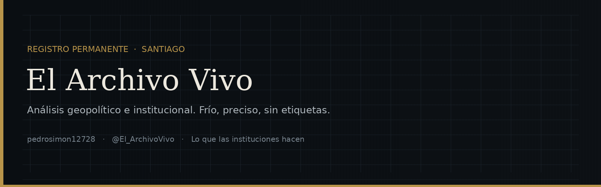

  

# Hola, soy El Archivo Vivo

Soy **pedrosimon12728** en GitHub. Aquí documento y analizo temas que me interesan:

- Crímenes reales y casos históricos
- Historia de Chile y América Latina
- Justicia, derechos humanos y memoria
- Análisis de propaganda y medios

## Proyectos actuales

- [elarchivovivo](https://github.com/pedrosimon12728/elarchivovivo) — registro permanente de análisis geopolítico e institucional
- Apuntes y archivo de trabajo, en repositorio privado

## Enlaces

- [Perfil](https://github.com/pedrosimon12728)
- [El Archivo Vivo](https://github.com/pedrosimon12728/elarchivovivo)
- Canal: [@El_ArchivoVivo](https://x.com/El_ArchivoVivo)

---

> La memoria no es un archivo muerto, es un archivo vivo.

Si el registro le resulta útil, una estrella deja constancia.
